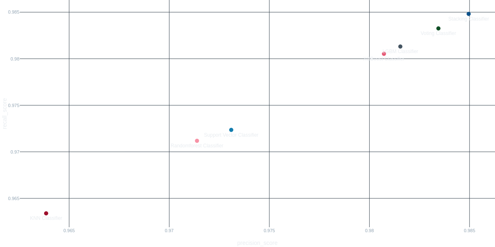

# ✋ Hand Recognition Using MediaPipe

This project uses [MediaPipe](https://mediapipe.dev/) to perform real-time hand detection and recognition. It identifies hand landmarks, tracks movement, and classifies gestures. The end goal is to use this model to build a **presentation control app**, allowing users to move between slides using simple hand gestures — no clicker needed!

---

## 🚀 Features

- Real-time hand tracking using MediaPipe  
- Detection of 21 hand landmarks  
- Custom gesture recognition using angles and distances  
- Easily extendable to support more gestures and actions  

---

## 📁 Project Files

- `playground.ipynb` – Main notebook for hand tracking and gesture classification  
- `requirements.yml` – Conda environment file to recreate the setup  

---

## 🛠️ Getting Started

### 1. Clone the repository

```bash
git clone https://github.com/your-username/hand-recognition-app.git
cd hand-recognition-app
```

### 2. Create and activate the environment

conda env create -f environment.yml
conda activate hand-gest

### 3. Have fun with either the notebook or the main.py file

    jupyter notebook playground.ipynb
    python main.py

---

## 📊 Model Performance Comparison

During experimentation in the `playground.ipynb` notebook, several machine learning models were trained and evaluated for hand gesture classification. Below are the key performance metrics (validation and test accuracy/F1 score) for each model:

| Model                | Validation Accuracy | Validation F1|
|----------------------|--------------------|--------------|
| KNN                  | 0.9633             | 0.9633       |
| Random Forest        | 0.9711             | 0.9711       |
| SVC                  | 0.9723             | 0.9723       |
| XGBoost              | 0.9805             | 0.9806       |
| LGBM                 | 0.9813             | 0.9814       |
| Voting Classifier    | 0.9832             | 0.9833       |
| **Stacking Classifier** | **0.9848**      | **0.9848**   |



All ensemble models (Random Forest, SVC, XGBoost, LGBM, Voting, and Stacking) performed exceptionally well, with the stacking classifier slightly outperforming or matching the best results on both validation and peroforming consistantly good on test sets with **0.984** F1 and Accuracy score. This consistent top performance is why the stacking classifier was selected as the final model for deployment.

---

## 🎯 Future Plans

    ✅ Build a presentation controller app to navigate slides using gestures

    ✅ Add a simple GUI for easier usage

    ⏳ Add more gestures (e.g., zoom, pointer) and custom action mapping

## 🖼️ Sample Output


## 🤝 Contributing

Pull requests are welcome! Feel free to fork this project and suggest improvements or additional features.

>Made with ❤️ using Python, OpenCV, and MediaPipe
